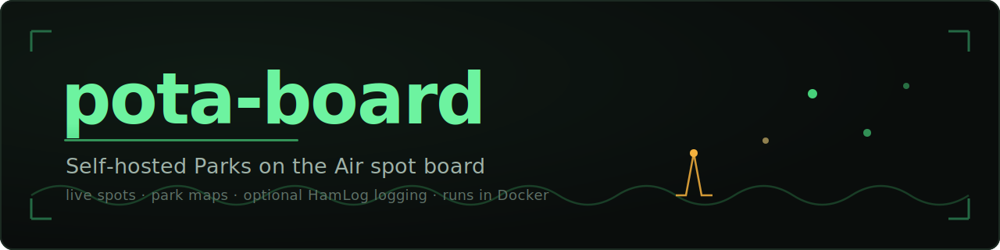

  

  A self-hosted <a href="https://parksontheair.com/">Parks on the Air</a> spotting
  dashboard you run on your own computer. 
  Live spot board, maps, operator profiles, one-click re-spotting, and optional
  logging — all in one small app.

  
  
  

---

## 🚀 Set it up in a few minutes

You don't need to be technical. Pick your computer and follow the guide — each one is
written step-by-step, no experience assumed:

| | Guide |
|---|---|
| 🪟 **Windows** | **[Install on Windows →](docs/install/windows.md)** |
| 🍎 **macOS** | **[Install on macOS →](docs/install/macos.md)** |
| 🐧 **Linux** | **[Install on Linux →](docs/install/linux.md)** |

In short: install **Docker**, download this project, run **`docker compose up -d`**,
and open **http://localhost:8075**. That's it.

> Prefer to run it directly with Node.js instead of Docker?
> See **[Run without Docker](docs/install/without-docker.md)**.

---

## 📡 What you can do

A quick tour — the full walkthrough is in the **[usage guide](docs/usage.md)**.

**See who's on the air, live.** A self-refreshing board of every activator currently
spotted — callsign, frequency, mode, park, comments, and how long ago they were
heard. Fresh spots glow; old ones fade.

**Filter to exactly what you want.** One-tap pills for band, mode, region, QRT, and
"hide parks I've already worked," each showing live counts.

**See where every park is.** Each spot has a mini-map; hover for a preview, click for
a full zoomable map, or open the **overview map** to see the whole board at once.

**Know who you're working.** Hover any callsign for that operator's POTA profile —
parks, activations, contacts, and awards.

**Re-spot and self-spot.** Bump a fading activator back up the list with one click,
or post your own spot when *you're* the one at the park. Both post straight to the
POTA network — no login required.

**Make it yours.** Dark or light theme, adjustable refresh rate, satellite/dark map
styles, your callsign for hunted-tracking — all saved in your browser.

---

## 📓 Optional: log your contacts to HamLog

If you keep a logbook with **[HamLog](https://github.com/kbennett2000/HamLog)** — a
free, self-hosted ham radio logbook by the same author — pota-board can log the parks
you hunt straight into it. When connected, the re-spot window gains an opt-in
**"Also log this contact to HamLog"** checkbox.

It's entirely optional, off by default, and deliberately careful with your log. Full
details (and how to connect it) are in the **[HamLog guide](docs/hamlog.md)**.

---

## 🛠️ Under the hood

- The whole dashboard is a **single self-contained HTML file** (`public/index.html`)
  — vanilla JavaScript, no framework, no build step.
- A tiny **Node/Express** server (`src/server.js`) serves it and provides the small,
  same-origin `/api/hamlog` proxy so your HamLog password never reaches the browser.
- Spot data comes straight from **[pota.app](https://pota.app)**'s public API.
- Ships as one small Docker image on port **8075**.

Developer notes live in [`docs/HAMLOG-INTEGRATION.md`](docs/HAMLOG-INTEGRATION.md).
The doc screenshots are generated from synthetic data — see
[`scripts/screenshots/`](scripts/screenshots/).

## License

MIT — see [`LICENSE`](LICENSE).

## Credits

Spot data and park info from [pota.app](https://pota.app). Maps © OpenStreetMap
contributors, © CARTO, © Esri. Built in the POTA spirit — 73!
