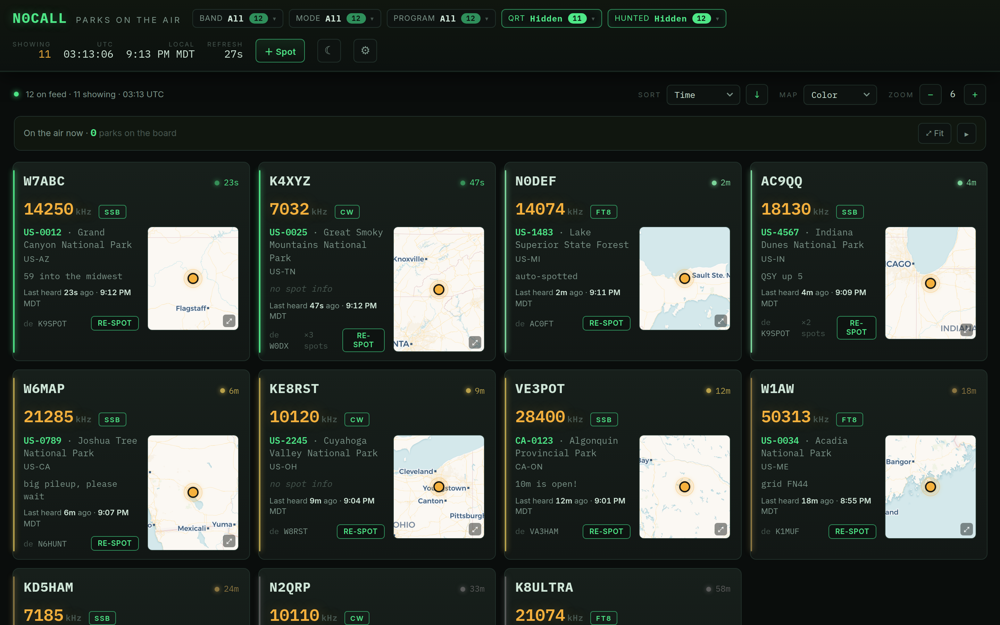

# Install pota-board on Linux

This gets the dashboard running on a Linux machine (a desktop, or a home server like
a Raspberry Pi or an old PC) in about 10 minutes.

> **What you're doing:** pota-board runs inside **Docker**, a free program that
> packages the app so it "just works". You install Docker once, download
> pota-board, and start it with a single command.

These steps use a terminal. They're written for **Ubuntu/Debian**; other distros are
similar (use your own package manager).

---

## Step 1 — Install Docker

The official one-line installer works on most distributions:

```bash
curl -fsSL https://get.docker.com | sh
```

Then let your user run Docker without `sudo` (log out and back in afterward):

```bash
sudo usermod -aG docker $USER
```

(Full instructions and other distros: **https://docs.docker.com/engine/install/**.)
Modern Docker includes **Compose** built in — no separate install needed.

## Step 2 — Download pota-board

Clone it with git:

```bash
git clone https://github.com/kbennett2000/pota-board.git
cd pota-board
```

(No git? Download the ZIP from **https://github.com/kbennett2000/pota-board** →
green **`< > Code`** button → **Download ZIP**, then unzip and `cd` into the folder.)

## Step 3 — Add your free map key

The **Color** and **Dark** maps come from **CARTO**, which now requires a free API
key. Without one the board still works — every map is just stamped with an
"API KEY REQUIRED" watermark. (The **Satellite** map comes from Esri and needs no key.)

1. Go to **https://carto.com/basemaps/apikey/** and request a key. It's free, takes
   about a minute, and needs no account. You'll get something like `cb1_xxxxxxxx`.
2. From inside the `pota-board` folder, copy the example config and open it:

   ```bash
   cp .env.example .env
   nano .env
   ```

3. Find the line reading `CARTO_API_KEY=` and paste your key straight after the `=`,
   no spaces:

   ```
   CARTO_API_KEY=cb1_xxxxxxxx
   ```

4. Save and exit (**Ctrl + O**, **Enter**, then **Ctrl + X** in nano).

> **Want to skip this for now?** You can — the board runs fine without a key, the maps
> just carry a watermark. Come back and add it whenever you like.

## Step 4 — Start it

From inside the `pota-board` folder:

```bash
docker compose up -d
```

The first time, Docker builds the app (a minute or two), then starts it in the
background.

## Step 5 — Open the dashboard

On the same machine, open a browser to:

> ### http://localhost:8075

From another device on your network, use the server's IP, e.g.
`http://192.168.1.50:8075`.

You should see the spot board:



## Step 6 — Set your callsign

Click the **⚙ gear** (top-right) and type your callsign in **Your callsign**. It's
saved in your browser — it is *not* sent anywhere or stored in the app. Now the
**Hunted** filter knows which parks you've already worked.

🎉 **That's it — you're running pota-board.** Next, read the
[How to use the dashboard](../usage.md) guide.

---

## Everyday commands

From inside the `pota-board` folder:

| To… | Run |
|---|---|
| Stop the dashboard | `docker compose down` |
| Start it again | `docker compose up -d` |
| Update to the latest | `git pull` then `docker compose up -d --build` |
| See logs | `docker compose logs -f` |

It's set to `restart: unless-stopped`, so it comes back automatically after a reboot.

## Troubleshooting

- **`permission denied` talking to Docker** — you haven't joined the `docker` group
  yet (Step 1), or you need to log out and back in for it to take effect.
- **Port 8075 already in use** — edit `docker-compose.yml`, change `- "8075:8075"`
  to `- "9075:8075"`, save, run `docker compose up -d`, and use port `9075`.
- **The maps say "API KEY REQUIRED"** — the free CARTO map key isn't set. Add it to
  `.env` (Step 3) and run `docker compose up -d` again, then force-refresh the page
  with **Ctrl + Shift + R** — map tiles are cached by your browser *and* by CARTO, so an
  old watermarked one can linger for a moment.
- **No spots show** — check the machine has internet; the board pulls live spots
  from pota.app and retries automatically.

Prefer not to use Docker? See **[Run without Docker](without-docker.md)**.
