# How to use the dashboard

A friendly tour of everything pota-board can do. If you haven't installed it yet,
start with the [setup guides](../README.md#-set-it-up-in-a-few-minutes).

New to POTA? **Parks on the Air** is an activity where hams operate from parks
("activators") and others contact them ("hunters"). A **spot** is a quick public
post saying "I'm on the air at this park, on this frequency" so hunters can find
them. pota-board is a live, good-looking window onto that spot feed.

---

## The spot board

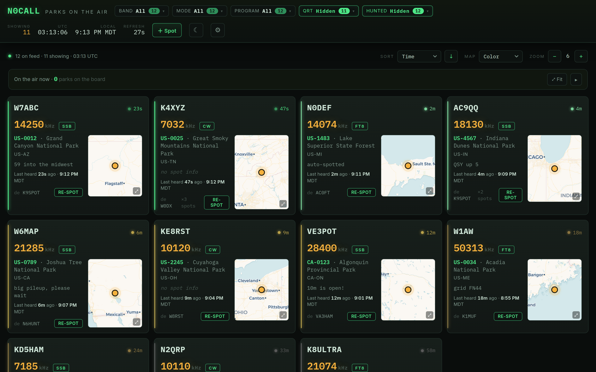

The main screen is a grid of **cards**, one per activator currently on the air. It
refreshes itself automatically (every 30 seconds by default). Each card shows:

- **Callsign** of the activator (top-left) and how long ago they were last heard
  (top-right). Fresh spots glow green; older ones fade to gray.
- **Frequency** (in kHz) and **mode** (SSB, CW, FT8, …).
- **Park** reference (like `US-0012`) and name — the reference links to the park's
  page on pota.app.
- The activator's **comment**, the **spotter** who reported them (`de …`), and a
  **Re-spot** button.
- A little **map** of where the park is.

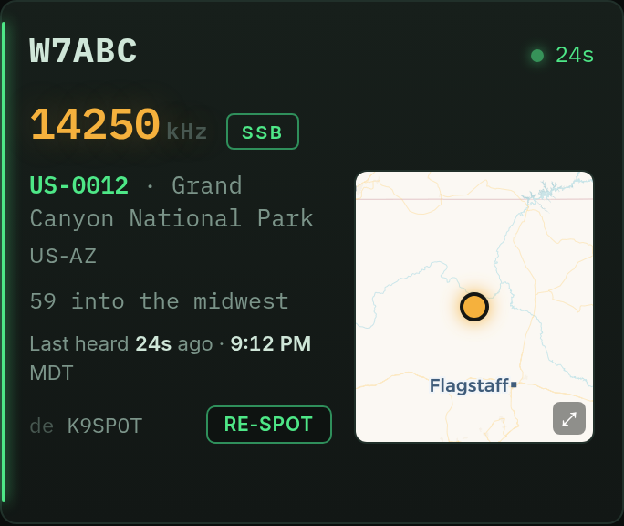

## Filtering what you see

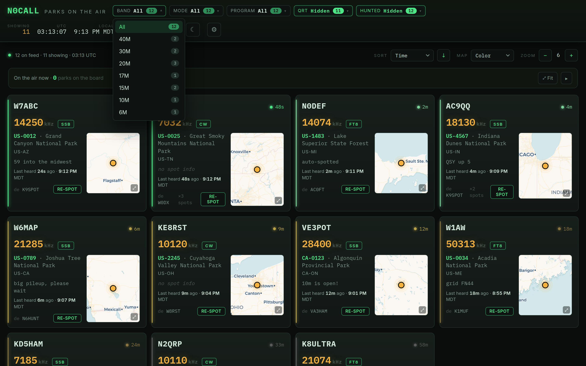

The pills across the top let you narrow the board. Click one to open it; the number
on each option tells you how many spots match right now:

- **Band** — 20M, 40M, etc., or All.
- **Mode** — Phone (voice), CW (Morse), Data (FT8/digital), or All.
- **Program** — region, e.g. US + Canada, or everywhere.
- **QRT** — show or hide activators who've signed off ("QRT").
- **Hunted** — show or hide parks you've already worked (needs your callsign set —
  see [Settings](#settings)).

The **Showing** count in the top-right tells you how many spots passed your filters.

## Sorting

Above the board, **Sort** lets you order spots by time, callsign, frequency, mode,
park, region, or spotter, and the **↑ / ↓** button flips the direction.

## The maps

pota-board is map-heavy because seeing *where* a park is helps you decide who to
chase.

- **Mini-map** on each card — hover it for a bigger floating preview:

  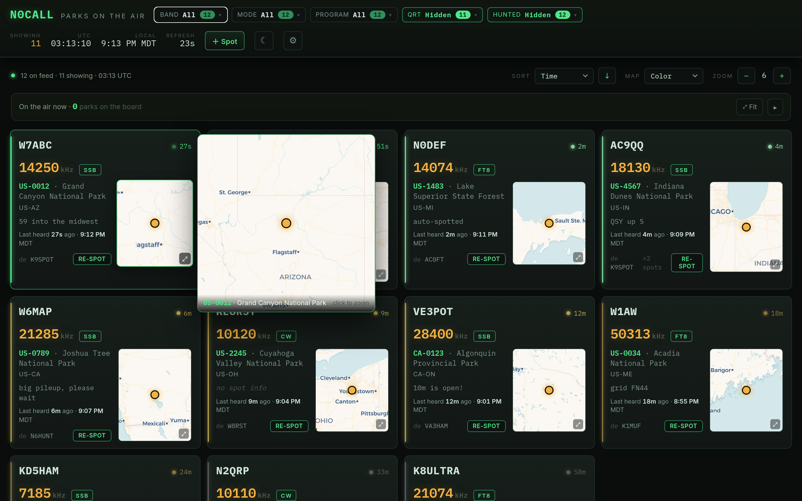

- **Click any map** to open a full, zoomable view:

  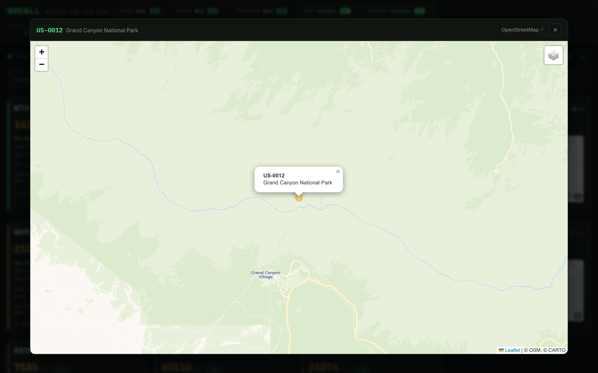

- **Overview map** — a single map of *every* park on the board. Dots are colored by
  how recently each was spotted; click a dot to jump to that card. Use **⤢ Fit** to
  frame them all, and the **▾** toggle to collapse it.

  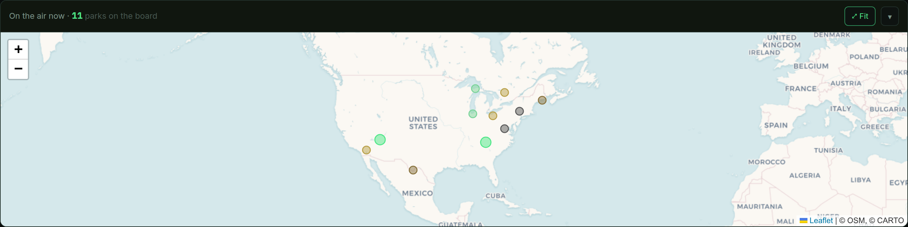

Pick the map look with the **Map** dropdown (Color, Satellite, Dark) and the **+ / −
zoom** next to it.

## Operator profiles

Hover (or tap) any activator's callsign to see a quick **profile card** pulled from
pota.app — how many parks they've activated and hunted, total contacts, awards, and
where they are.

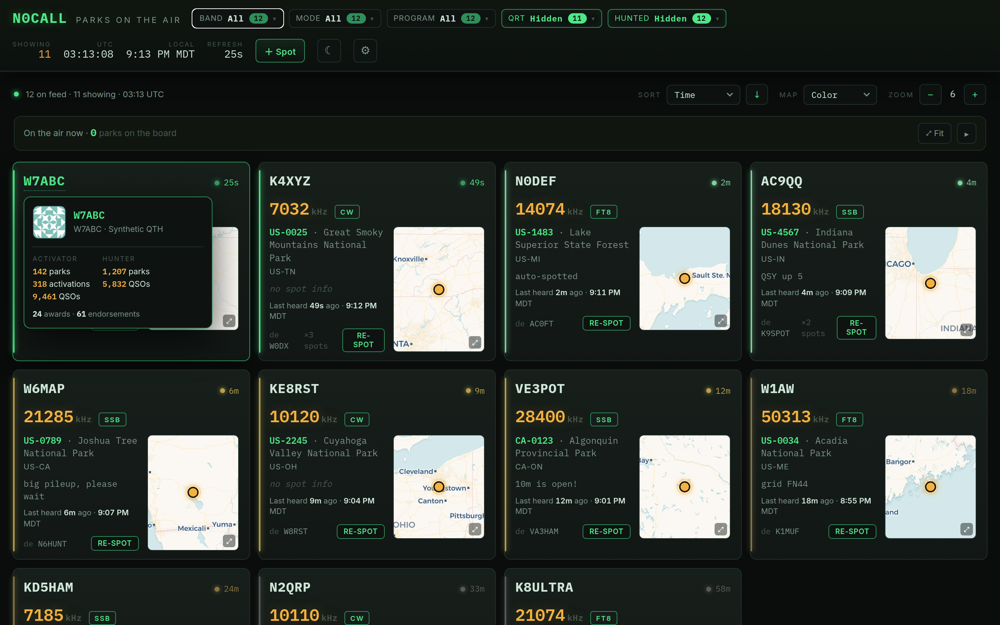

## Re-spotting an activator

Worked someone, or want to bump a fading spot back up the list? Click **Re-spot** on
their card. The form is pre-filled with their callsign, frequency, park, and mode —
add a comment if you like and click **Spot**. It posts straight to the live POTA
network (no login needed).

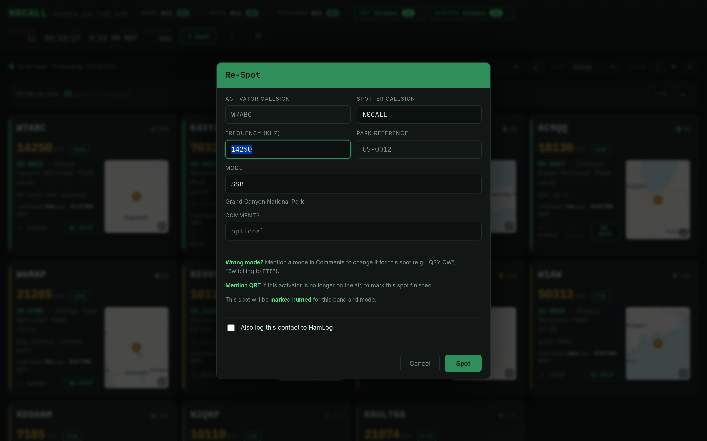

See that **"Also log this contact to HamLog"** checkbox? That's optional logging —
covered in the [HamLog guide](hamlog.md). It only appears if you've connected
HamLog.

## Self-spotting (you're the activator)

If *you're* the one out at a park, click **＋ Spot** (top-right) to post your own
spot. Fill in your callsign, the park reference, your frequency and mode, and click
**Spot**.

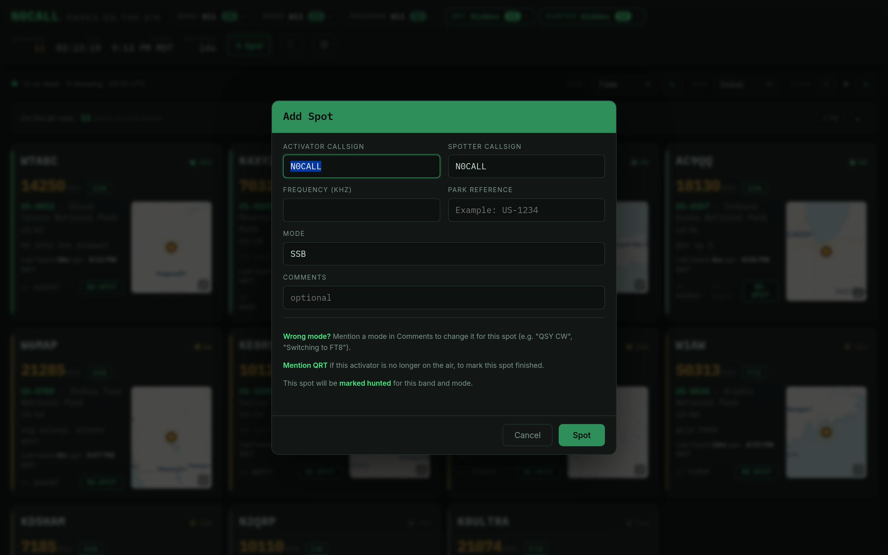

## Settings

Click the **⚙ gear** (top-right) to open settings. Everything here is saved in your
browser only.

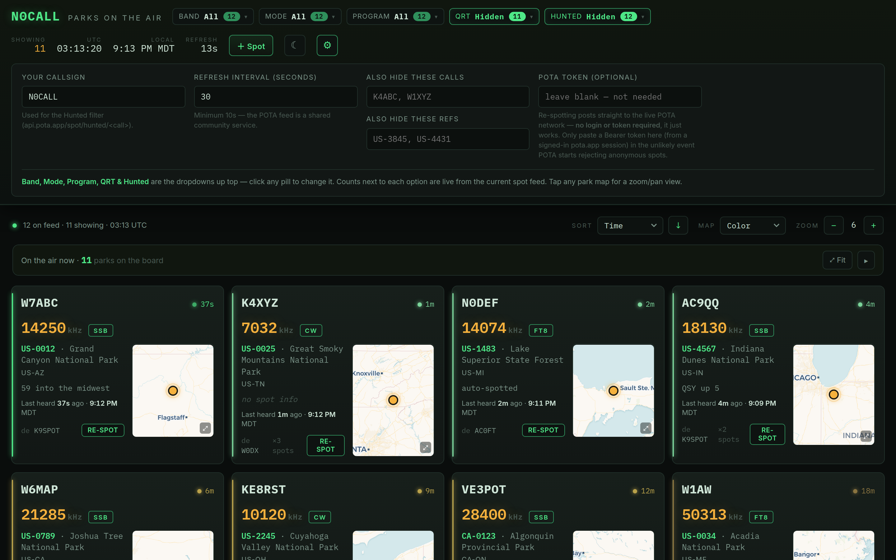

- **Your callsign** — powers the **Hunted** filter (so you can hide parks you've
  already worked).
- **Refresh interval** — how often the board updates (10 seconds minimum — the POTA
  feed is a shared community service, so please don't hammer it).
- **Also hide these calls / refs** — a comma-separated list of activators or parks
  you'd rather not see.
- **POTA token** — almost always leave this blank. Re-spotting works anonymously; you
  only need a token in the rare case POTA starts refusing anonymous spots.

You can also switch between **dark and light** themes with the moon/sun button, and
the clocks in the header show both **UTC** and your **local time**.

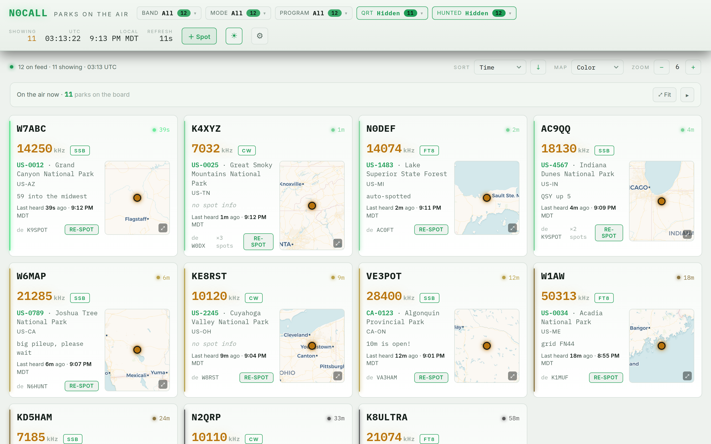

---

Want to log the parks you hunt into a real logbook? See **[Logging to HamLog](hamlog.md)**.
